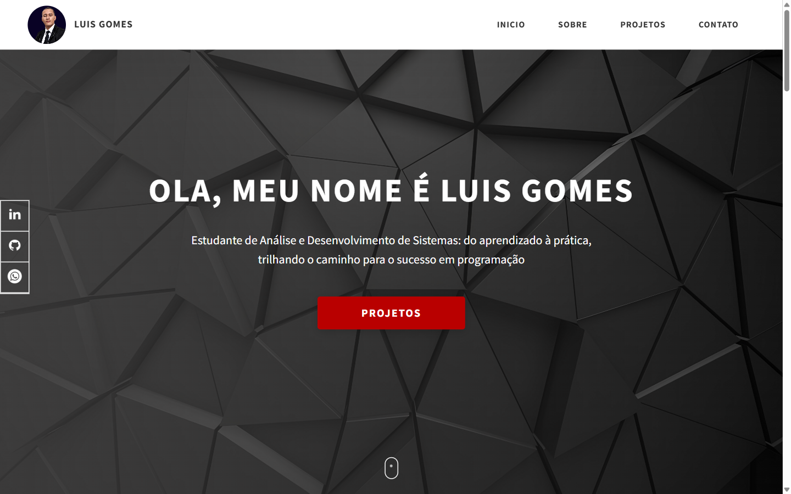

<div align="center">

# Portfólio

**Meu site pessoal: quem sou, o que sei fazer, projetos com estudo de caso e contato. HTML, SCSS e JavaScript puro, publicado no GitHub Pages.**

<a href="https://luis-lhgdf.github.io/portfolio/"></a>

[](https://luis-lhgdf.github.io/portfolio/)


</div>

---

## Ver online

**https://luis-lhgdf.github.io/portfolio/**

Servido direto da branch `main` pelo GitHub Pages. Sem build no deploy: o CSS compilado (`css/style.css`) já vai versionado.

## O que tem no site

| Seção | Conteúdo |
|---|---|
| **Início** | Apresentação e chamada para os projetos |
| **Sobre mim** | Quem sou e o que estudo |
| **Minhas skills** | Linguagens, bibliotecas e ferramentas |
| **Projetos** | Cards com estudo de caso: SYS Comercial, ZTYPE Bot, FakePinterest, Python World e Unibot (`project-1.html` a `project-5.html`) |
| **Contato** | Formulário e links para redes |

## Rodando localmente

```bash
git clone https://github.com/Luis-lhgdf/portfolio.git
cd portfolio
```

Abra `index.html` no navegador, ou sirva a pasta:

```bash
python -m http.server 8000
# http://localhost:8000
```

### Editando os estilos

O CSS é gerado a partir de `sass/`. Os scripts do `package.json` compilam, prefixam e comprimem:

```bash
npm install
npm run compile:scss   # observa sass/ e regrava css/style.css
npm run build          # autoprefixer + compressão do css/style.css
```

O `node-sass` 6 roda em Node 14 a 16. Em versões mais novas do Node, troque por `sass` (`npm i -D sass`) e ajuste o script `compile:scss` para `sass sass/main.scss css/style.css -w`.

## Estrutura

```
index.html               página única com todas as seções
project-1..5.html        estudo de caso de cada projeto
index.js                 menu hambúrguer e interações
css/style.css            CSS compilado (o que o site usa)
sass/
  abstracts/             variáveis, mixins e utilitários
  base/                  reset e base
  components/            header, footer, skills, mouse-scroll
  pages/                 home e estudo de caso
assets/                  imagens, ícones e vídeo dos projetos
docs/                    print usado neste README
```

## Créditos

Layout baseado no template open source [Dopefolio](https://github.com/rammcodes/Dopefolio), de Ram Maheshwari, adaptado em conteúdo, cores e seções.

---

## English

My personal portfolio: about, skills, project case studies and contact. Plain HTML, SCSS and vanilla JavaScript, served by GitHub Pages at https://luis-lhgdf.github.io/portfolio/. Layout based on the open source Dopefolio template. **Content is in Portuguese.**

---

## Licença

MIT — veja [LICENSE](LICENSE).
